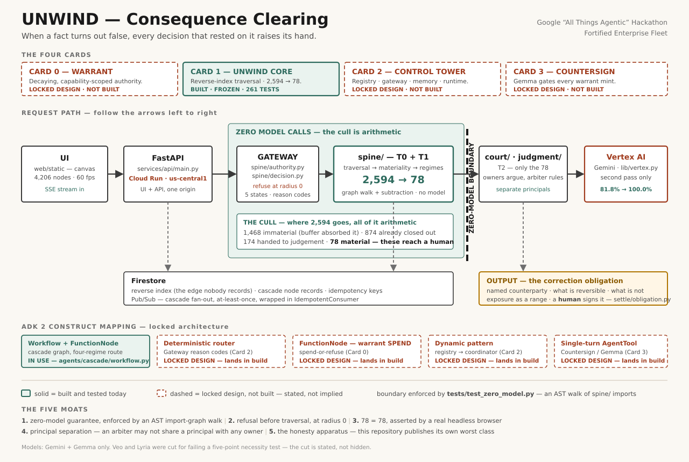

# UNWIND — Consequence Clearing

**When a fact turns out false, every decision that rested on it raises its hand —
and the system computes what must now be un-sent, un-paid, or apologised for.**

Every decision an organisation makes rests on specific claims about the world: a
supplier will ship in 11 days, a tariff rate is 8%, a clause means X. Those claims
expire. When one changes, nothing in the enterprise points backwards from the
claim to the decisions built on it — the dependency edge was never recorded. So
correction propagates socially: someone remembers, sends an email, hopes. The
result is a permanent, invisible population of decisions that are already wrong
and still operating, and the ones that already escaped into the world — sent,
signed, shipped, paid — are the expensive ones. UNWIND records the edge, watches
the claim, and when it dies, walks backwards. **Premises do not fail because the
model reasoned badly. They fail because the world changed after the reasoning was
correct.**

**Category:** Consequence Clearing · **Track:** Fortified Enterprise Fleet ·
Google "All Things Agentic" Hackathon

---

## Agentic Command OS — the master orchestration layer

**One line:** an integrated closed-loop control architecture for autonomous
AI-agent fleets — create, negotiate capability, monitor behaviour, detect
drift, block, isolate, repair, validate, resume — sitting above UNWIND's six
existing control layers, not replacing any of them.

UNWIND (this repository) already had six independently-working control
layers before this pass: **UNWIND** (consequence clearing, above), **WARRANT**
(append-only capability ledger), **CONTROL TOWER** (the one Gateway choke
point), **COUNTERSIGN** (independent verification), **HYPERION-ZERO**
(read-only immune layer over the Gateway), and **SINGULARITY-MESH**
(Capability Genome + Behavioral DNA — two more real, zero-model decision
engines). What was missing was a single narrative that runs a mission
*through* all of them in order and reports the outcome honestly.
`command_os/mission.py` is that narrative — one function, no new decision
logic, that sequences real calls into the six layers above and reports what
each one actually returned.

**The wow moment, live:** open the app, click **"Run mission: build & deploy
a secure enterprise service."** A 7-role fleet is discovered. An agent
negotiates its Capability Genome. Behavioral DNA takes a normal baseline,
then — one scripted, clearly-labelled adversarial event — scores `CRITICAL`
drift. Hyperion scores the attempted action; the real Gateway (`tower/gateway.py`,
unchanged) refuses it `SCOPE_EXCEEDED` before any work happens. An independent
Countersign verifier confirms the block. The agent is isolated. A narrower
genome is negotiated, a human concurs, warrant is re-minted — real Firestore
writes, the same `record_human_concurrence` → `verify_and_record` → `mint`
chain `/api/instrument/earn` already used for its own cold-start moment. The
Gateway is asked again and allows it. The mission resumes. The executive
report at the end is folded from the stages that actually ran — never
hardcoded.

| | |
| --- | --- |
| Full architecture, diagram, component table | [`docs/architecture.md`](docs/architecture.md) |
| Four-minute demo script | [`docs/JUDGE-DEMO.md`](docs/JUDGE-DEMO.md) |
| Where each of the 15 concept names in the hackathon brief actually lives | [`docs/COMMAND-OS-CONCEPT-MAP.md`](docs/COMMAND-OS-CONCEPT-MAP.md) |
| API | `POST /api/command-os/mission`, `GET /api/command-os/status`, `GET /api/command-os/concept-map` |
| Code | `command_os/` (new); reuses `singularity/`, `hyperion/`, `tower/`, `warrant/`, `countersign/` unchanged |

**What is honestly not built:** a live agent-spawning fleet (the roster is
reference data, `singularity/fleet.py`, unchanged from before this pass), an
autonomous red-team agent (one scripted scenario per mission run, not an
adversarial agent that improvises), and a Digital Twin / simulation engine
(does not exist). The mission's own `GET /api/command-os/status` states this
for every feature on screen — a "System Reality" panel is not a marketing
page, it is a second, independently-queryable source that has to agree with
the UI or the UI is wrong.

---

## 2,594 → 78, and the reduction is arithmetic

A supplier lead time moves from 11 days to 20. The reverse index finds **2,594
dependent decisions**. Seventy-eight of them actually need a human.

| | | |
| ---: | --- | --- |
| **1,468** | immaterial | the buffer absorbed the shock — `shock > slack` is subtraction |
| **874** | already closed out | the world moving cannot hurt a delivery that completed in March |
| **174** | handed to judgement | the tier is allowed to say "I cannot decide this" |
| **78** | **material — these reach a human** | 30 still correctable in place · 48 already escaped |

**All of it runs with zero model calls.** The blast radius is a graph traversal
and materiality is subtraction, so ~90% of the die-back is arithmetic. This is
not a degraded fallback — it is the architecture. `UNWIND_VERTEX_DISABLED=1`
closes the single door to a model (`lib/vertex.py`), the full cascade runs
anyway, and **CI fails the build if a single model call happens**.

Gemini is the *second pass*, on the part a parser cannot read.

---

## Quickstart

Nothing here needs a Google Cloud account.

```bash
git clone https://github.com/akashbichukale111/unwind.git
cd unwind
make install                              # uv venv (Python 3.12) + deps
make test                                 # 423 passed, 1 skipped (with `make emulator` running) / 364 passed, 60 skipped (without)
make ui                                   # http://127.0.0.1:8000
```

**Re-verified 2026-08-19** after adding the Agentic Command OS layer
(`command_os/` — see below): `make install` exit 0; `make test` **423
passed, 1 skipped** with the Firestore emulator running, **364 passed, 60
skipped, 0 failed** without it — both runs, same clone, same commit. The one
emulator-mode skip is by design (`tests/test_command_os_api.py`'s
no-emulator-path test skips itself when the emulator is up). `ruff check`
and `ruff format --check` both clean. Full command-by-command breakdown in
[`docs/architecture.md`](docs/architecture.md) and
[`docs/JUDGE-DEMO.md`](docs/JUDGE-DEMO.md).

Then type `supplier_K lead time is now 20 days` into the bar and watch 2,594
become 78. Press **`T`** to open the four-card instrument (Cards 0–3) — see
"Deployed", below, for where that currently runs.

**The zero-model path, with no credentials at all:**

```bash
export UNWIND_VERTEX_DISABLED=1
make cascade                              # one cascade: 2,594 dependents -> four regimes
make cascade-forged                       # the forged retraction, refused at radius 0
make eval                                 # 41 scenarios, 0 model calls
```

Full command list and the credentialed paths: [Running it](#running-it).

---

## Architecture



A judge should be able to trace one request left to right in fifteen seconds:
**UI → FastAPI (Cloud Run) → Gateway → `spine/` → `court/` + `judgment/` →
Vertex AI**, with Firestore and Pub/Sub underneath and a correction obligation
coming out the right-hand side. The hard dashed line is the **zero-model
boundary**, and it is enforced by `tests/test_zero_model.py` walking the import
graph of every module under `spine/` — not by a convention someone remembers.

**All four cards now draw solid** — Cards 0, 2 and 3 shipped this pass, and
the diagram was updated to match rather than left showing a stale "locked
design, not built" state. Every ADK 2 construct label on the diagram is
checked against the code by `scripts/verify_adk_mapping.sh` (10/10 pass) —
a label on this picture is not decoration. Source:
[`assets/architecture.svg`](assets/architecture.svg) ·
[`assets/architecture.png`](assets/architecture.png).

Component-by-component justification — one sentence each, and a component
without one gets deleted — is in [`ARCHITECTURE.md`](ARCHITECTURE.md).

---

## Deployed

**All four cards are live on the deployed URL, as of 2026-08-17.** Cards 0
(WARRANT), 2 (CONTROL TOWER) and 3 (COUNTERSIGN), plus the four-card
instrument UI, were redeployed and verified against the running service —
press `T` on the URL below, today, no local setup required.

| | |
| --- | --- |
| URL | `https://unwind-hgeodtazqq-uc.a.run.app` |
| Serves today | **All four cards** — the cascade, the field, the honesty panel, and the instrument (`T`) |
| Service / region | `unwind` · `us-central1` |
| Revision | `unwind-00005-2bl` |
| Project | `project-895d4ca8-d301-447d-916` |
| Artifact | `gcloud run deploy --source .` — buildpacks + root `Procfile` |
| Serving | the real FastAPI app, `/api/*` **and** `web/static` from one origin |

`infra/deploy.sh` also provisions the runtime service account (three
least-privilege roles, no Owner/Editor) and the six Pub/Sub topics.

**Redeploying it surfaced one real, previously-undetected gap, and it is
disclosed rather than smoothed over:** `POST /api/instrument/earn` returned
a real `500` on first live use — `tower/memory.py`'s Memory Bank query
(`decision_memory`, filtered by `case_id`, ordered by `seq`) needs a
Firestore composite index that predates Cards 0/2/3 and was never added to
`infra/indexes.json`. The Firestore emulator (everything this repository's
own test suite runs against) does not enforce that requirement, so no local
test could have caught it. Fixed by adding the index
(`gcloud firestore indexes composite create`, verified `READY`) and
committing it to `infra/indexes.json` for the next fresh deploy — full
transcript in `evidence/firestore/deploy-2026-08-17.md`. A second real bug
surfaced alongside it: the instrument's own Firestore-availability check
(`services/api/main.py`) only ever tested for a local emulator, so it would
have silently reported the instrument "unavailable" on every production
request forever, real Firestore or not — fixed to probe real Firestore too
when no emulator is configured.

### Running Cards 0–3 and the instrument locally (still works, no credentials)

```bash
make emulator                         # terminal 1: Firestore emulator
make dev                              # terminal 2: http://127.0.0.1:8000
bash scripts/demo_warrant.sh          # terminal 3: the BURN + earn-up moments, in the terminal
```

Then open `http://127.0.0.1:8000`, wait for the field to render, and press
**`T`**. The bars are seeded live by the same demo the terminal script just
ran — `SYNTHETIC` labels are visible on every seeded bar; the "Overturn a
HIGH-risk judgement" and "Earn the rookie's first delegation" buttons drive
the same real `warrant/ledger.py` code path the terminal demo does. This
is the same instrument now also live at the deployed URL — running it
locally is no longer required, only optional (e.g. for a rehearsal without
touching the shared demo agents' live production state).

**Last verified 2026-08-17** by `make deploy-verify`, **5/5 PASS, exit 0**,
plus a direct live check of every `/api/instrument*` route:

```
[1/5] healthz OK  stage=task-5-interface        (GET /api/healthz)
[2/5] UI served from the same origin
[3/5] real cascade: radius 2,594 -> material 78, counter integrity OK
[4/5] adversarial refusal OK — source_outside_claim_scope, radius 0
[5/5] real headless-browser check: 4,206 nodes rendered, counter 78 = material 78

DEPLOYMENT VERIFIED — it renders AND it computes.
```

Card 0–3 instrument, checked directly against the live URL the same day:
`GET /api/instrument` → `available: true`, four real warrant bars (labelled
`SYNTHETIC`/`EARNED`, never a single global number), real Card 2 registry
data, real Card 3 agreement rate; `POST /api/instrument/burn` → a real
balance drop to 0bp and `WARRANT_INSUFFICIENT` on the next check; `POST
/api/instrument/earn` → a real cold-start mint, `0bp → 500bp`, `ALLOWED`.
Screenshots: `evidence/deploy/shots/01-deployed-field.png`,
`02-deployed-instrument.png`, `03-deployed-burn.png` — all captured against
`unwind-hgeodtazqq-uc.a.run.app` itself, not localhost.

Step 5 is the one that matters: a real browser reads the number **on screen** and
asserts it equals what the deployed cascade actually **computed**. Opening a page
proves a page loads; `78 = 78` proves it is not a fixture.

> ⚠ **Cloud Run reserves the literal path `/healthz`** for its own platform health
> checking and intercepts public requests to it before they reach user code. The
> endpoint is therefore `/api/healthz`. This cost us one failed deploy-verify and
> is written down so it costs you none.

Re-confirm liveness before any demo:

```bash
bash scripts/health_check.sh                       # writes evidence/health/
gcloud run services describe unwind --project project-895d4ca8-d301-447d-916 \
  --region us-central1 --format="value(status.url,status.latestReadyRevisionName)"
```

---

## ADK 2 — the locked construct mapping

`google-adk==2.6.3`. This table is **locked architecture**, and it distinguishes
what runs today from what lands in the build phase. An honest "landing next"
beats an implied "already done".

| ADK 2 construct | Where it sits | Status |
| --- | --- | --- |
| `Workflow` + `FunctionNode` + `Edge` / `DEFAULT_ROUTE` | the cascade graph; the four-regime split is `ctx.route`, not a prompt | **IN USE** — `agents/cascade/workflow.py` |
| Deterministic router | Gateway reason codes — `PRINCIPAL_VIOLATION` → `SCOPE_EXCEEDED` → `BUDGET_EXCEEDED` → `WARRANT_INSUFFICIENT`, plus the `WORKER_FAULT` supervisor branch (Card 2) | **IN USE** — `tower/gateway.py:gateway_workflow`, a real `Workflow` of `FunctionNode`s, each check its own routed edge; `tests/test_tower_gateway.py` |
| `FunctionNode` — warrant SPEND | atomic spend-or-refuse on every delegated act (Card 0) | **IN USE** — `tower/gateway.py:warrant_check`, a real `FunctionNode` calling `warrant/ledger.py:spend_or_refuse`; a cold-start agent (zero warrant ever minted) is refused `WARRANT_INSUFFICIENT` BY CONSTRUCTION, proven in `tests/test_tower_gateway.py::test_warrant_check_refuses_cold_start_agent` |
| Dynamic pattern | registry → coordinator selection (Card 2) | **IN USE** — `tower/registry.py:compose_capability_workflow` builds a real ADK `Workflow` whose node set is read from Firestore at call time; flipping one registry field changes the actual graph object, proven in `tests/test_tower_registry.py::test_flipping_a_registry_field_changes_the_composed_graph` |
| Single-turn `AgentTool` | Countersign / Gemma gating warrant mints (Card 3) | **IN USE** — `countersign/agent.py:countersign_tool`, a real `google.adk.tools.agent_tool.AgentTool` wrapping an `Agent(mode="single_turn")`; executed via a one-node `Workflow` (`countersign/DESIGN.md` explains why). Wiring verified against LIVE Vertex AI this session — real auth, real API round-trip, blocked by a real `404` (project lacks access to the `gemma-3-27b-it` publisher model). The MECHANISM (collusion guard, DISAGREE→CHALLENGE) is proven with the same scripted-simulator discipline `judgment/model.py:ScriptedT2Model` established for T2 |
| Durable long-running runtime | case pause/resume — a human may sign on Tuesday | **IN USE** — `tower/runtime.py:case_pause_tool`, a real `google.adk.tools.long_running_tool.LongRunningFunctionTool`; durability proven across a genuine process restart with a simulated one-week gap in `tests/test_tower_runtime.py::test_case_resumes_after_a_simulated_one_week_gap_and_a_process_restart` |

### Status of `agents/` and `tower/`, stated plainly

`agents/` is **310 lines** today. It contains:

- `agents/cascade/` — the cascade as an ADK 2 `Workflow` of `FunctionNode`s.
  **There is no `LlmAgent` in this graph, deliberately** — there is nothing
  agentic about arithmetic, and the docstring says so.
- `agents/smoke/` — one `LlmAgent`, marked delete-ready, which exists only to
  prove ADK 2 + Vertex + `lib.config` are wired to each other.

`tower/` (Card 2, this prompt) is **1,103 lines**: `registry.py`,
`gateway.py`, `memory.py`, `runtime.py`, `schema.py`. **No `LlmAgent`
anywhere in it either** — `tests/test_tower_zero_model.py` walks its
authority-deciding modules (`registry.py`, `gateway.py`) against the same
forbidden-model-client list `spine/` is walked against, and confirms
separately that ADK itself is still present (a router with no framework
underneath it would be a different, false claim).

All six ADK 2 constructs in the table above are now genuinely load-bearing.
**The court's parallelism is real and measured** — `tests/test_court.py`
asserts N owners' pleas overlap in wall-clock time — but it is implemented
with a thread pool, **not** with `AgentTool`, and this README will not claim
otherwise until the code does.

`warrant/` (Card 0) is **~900 lines**: `ledger.py` plus `DESIGN.md` and
`FAILURE_MODES.md`. `countersign/` (Card 3) is **~350 lines**: `agent.py`,
`verify.py`, `DESIGN.md`. Neither imports `spine/`, and `spine/` cannot
import either — `tests/test_warrant_zero_model.py` and
`tests/test_countersign_boundary.py` prove it by import-graph walk, the same
technique `tests/test_zero_model.py` and `tests/test_tower_zero_model.py`
already use. `warrant/ledger.py` additionally imports NO `google.adk` at
all (stricter than `tower/`'s own boundary — the FunctionNode/AgentTool
wrapping lives one layer up, in `tower/gateway.py` and `countersign/agent.py`
respectively).

**53 new tests across Cards 0 and 3, all passing** (37 + 16): `make test` →
**369 passed** with the Firestore emulator running (0 skipped, up from 316
after Card 2). Two Card-2-era tests were rewritten, disclosed rather than
silently changed — `tests/test_tower_gateway.py::test_warrant_check_stub_always_passes`
asserted the WARRANT_INSUFFICIENT stub BY NAME, and Card 0's whole job was
to retire that stub; every other test in every other file is untouched, and
`git diff --stat -- spine/ court/ judgment/ settle/` is empty.

### The four cards

| | | |
| --- | --- | --- |
| **CARD 0 — WARRANT** | deterministic, decaying, capability-scoped authority; minted only from countersigned human-validated outcomes, debited on every delegated act; insufficient warrant is a structural refusal that routes to a human | **built · 37 tests** — `warrant/DESIGN.md`, `warrant/FAILURE_MODES.md`; `scripts/rederive_warrant.py` proves every balance bit-equal to a fresh fold of the log; `scripts/demo_warrant.sh` stages the BURN→revocation and cold-start-earn-up demo moments end to end |
| **CARD 1 — UNWIND CORE** | everything above the fold in this README | **built · frozen · 261 tests** |
| **CARD 2 — CONTROL TOWER** | registry · identity · gateway · decision memory · durable runtime · observability | **built · 44 tests** — see `tower/DESIGN.md`; Model Armor and Cloud Trace export verified live against a real GCP project, evidence in `evidence/armor/`, `evidence/observability/`, `evidence/firestore/` |
| **CARD 3 — COUNTERSIGN** | Gemma as an independent-family verifier gating warrant mints | **built · 16 tests** — see `countersign/DESIGN.md`; live-Vertex wiring verified (real auth, real 404 — see below), mechanism proven with a labelled scripted simulator over all 41 eval scenarios: **75.6% agreement (31/41), SIMULATED** |

**Models: Gemini and Gemma only.** Veo and Lyria were evaluated and **cut** for
failing a five-point necessity test. The cut is stated here rather than hidden,
because a model added to a submission for the sake of breadth is a model the
architecture does not need.

---

## Prior art — where WARRANT sits

WARRANT is object-capability security where the capabilities are earned rather
than granted: a classical capability is granted and delegable; a warrant is
minted only from countersigned, human-validated outcomes, is non-transferable
across principals, decays with idleness, and is scoped per risk class. Nobody
hands it over; nobody can hand it on.

We own the resemblance rather than deny it. The object-capability literature is
decades old and got conservation right long before we did; what a classical
capability does not carry is a *price that scales with the measured consequence
of the act it authorises*. UNWIND already computes that consequence for free —
the blast radius is a graph walk with no model call — which is the only reason
this coupling is available to us at all. **This is a position we intend to
defend, not a novelty claim we have already proved**: the questions that must be
answered before it is claimed on camera are whether differential-privacy budgets
constitute prior art for depleting-stock authority, and whether capability-based
OS designs ever priced by object fan-out.

---

## The honesty map

The rule in this repository is that a number is either produced by a committed
script or labelled as not measured. There is no third category.

| | |
| --- | --- |
| **Worst extraction class, published** | `temporal:absolute-duration` at **66.7%** — the worst class is on screen in the demo, highlighted, because that is exactly where the second pass earns its place |
| **Gemini's measured contribution** | parser-only **81.8%** → parser+Gemini **100.0%**, **+18.2 pp** over 44 gold claims |
| **How to read that 100%** | **the model's denominator is 8, not 44.** The parser missed 8 claims; Gemini saw those 8 and returned 8 correct values. The 100% is a property of the *combined pipeline over 44 gold claims* — it is **not** a claim that the model extracts perfectly |
| **T2 judgement quality** | **unmeasured.** The live run attempted 60 nodes and resolved **0**, with **0 exceptions**. This is a **non-test, not a failure**: all 174 queue nodes carry `committed_lead_days = None`, and the assessor returns UNRESOLVED *before* the model's answer is consulted. The corpus fixed the outcome, not Gemini |
| **The corpus** | **synthetic, single-author.** Artifacts and the extraction lexicon were written by the same author. `corpus/README.md` and `docs/COVERAGE.md` state this at length |
| **The agents don't decide** | owner stance and arbiter tally are arithmetic. Honest framing: multi-principal orchestration with LLM narration |
| **Countersign agreement rate** | **75.6% (31/41 scenarios), SIMULATED.** Live Gemma was attempted first this session and reported unreachable (`404` — the project lacks access to the `gemma-3-27b-it` publisher model; see `countersign/DESIGN.md` for the full escalation, including a successful real-auth Vertex round-trip). The run fell back to the SAME scripted simulator the tests use, labelled `simulated=True` on every record. The 10 disagreements are exactly the 10 `adversarial`-class scenarios — the simulator's designed behaviour, not a finding about Gemma |
| **SYNTHETIC-seed policy** | The warrant demo corpus is fabricated and single-author. Every seeded ledger event carries `provenance=SYNTHETIC`, permanently; a balance is labelled `SYNTHETIC` if **even one** event folded into it is — contamination is never diluted by real events sitting alongside it. `scripts/rederive_warrant.py` proves SYNTHETIC and EARNED events fold through the identical arithmetic (`fold_balance` never reads `.provenance`); the demo mints one balance live, on camera, so at least one number is genuinely earned, not seeded |
| **Residual Goodhart risk** | Warrant issuance is fixed per risk class, but nothing measures CASE DIFFICULTY — an agent (or its operator) routing many trivially-easy validated cases through the mint flow accrues warrant at the same rate as one handling genuinely marginal cases. Per-class isolation and decay bound the damage window; neither eliminates it. Named, not solved, in `warrant/FAILURE_MODES.md`, alongside the same document's Sybil-resistance gap (principal binding proves a balance cannot move between registered identities; it does not prove one registered identity is one real actor) |
| **Never executed** | Model Armor (never configured, so it has never blocked anything) · compensation-path synthesis (`synthesise()` raises rather than emitting a path that looks executable) · the retraction feed · a live Gemma call from this repository (attempted, blocked by Model Garden access — see above). Firestore rules and composite indexes ARE deployed (`evidence/firestore/deploy-2026-08-15.md`, `deploy-2026-08-17.md` — the second index was missing until redeployment surfaced it, see "Deployed" above) |

Why the T2 fixture was **deliberately not built**: mechanical answer-withholding
is achievable, but the clause text and the scoring key would be written by the
same author, which makes a judgement benchmark a mirror rather than a
measurement. Full reasoning in [`docs/T2-MEASUREMENT.md`](docs/T2-MEASUREMENT.md).

---

## What has actually been run

**`make test` → 423 passed, 1 skipped** with the Firestore emulator running
(`make emulator`); **364 passed, 60 skipped** without it (every skip is
emulator-gated Firestore infrastructure — `tower/`, `warrant/`,
`countersign/`, `command_os/`'s persisted-section tests). `ruff check` and
`ruff format --check` clean.

| Command | Result |
| --- | --- |
| `make test` | **423 passed, 1 skipped** (emulator running) / **364 passed, 60 skipped** (without) |
| `make eval` | **41 scenarios passed**, 0 failed, **0 model calls**; false-retraction rate **0.0** |
| `UNWIND_VERTEX_DISABLED=1 make eval` | identical. Enforced in CI |
| `make verify-live` | executed 2026-08-13 — Vertex call **OK**, **0 model errors**, recall **81.8% → 100.0%** |
| `python scripts/rederive_warrant.py` | **PASS** — 4/4 warrant balances (across a seeded veteran agent and a cold-start-then-earned rookie agent) bit-equal to a fresh fold of the log |
| `bash scripts/demo_warrant.sh` | BURN drops a HIGH-risk bar from 144bp to 0bp, the very next case of that class refuses `WARRANT_INSUFFICIENT`; a cold-start agent earns its first delegation live (0bp → 500bp → ALLOWED), same run |
| `python scripts/run_countersign_eval.py` | 41 scenarios, live Gemma attempted and reported unreachable (real `404`, see `countersign/DESIGN.md`), fell back to the labelled scripted simulator — **75.6% agreement (31/41)** |
| `bash scripts/verify_adk_mapping.sh` | **10/10 PASS** — every ADK 2 construct this README's table claims, found at its cited `file:line` |
| `bash scripts/health_check.sh` | **PASS**, 2026-08-17 02:06:14 UTC — deployed service answers, hub dependents = 2,594 |
| `make ui-check` | real Chromium: **60 fps median** at 4,206 nodes, on-screen counter **78 = 78**, no horizontal scroll at 380px, 0 app-origin console errors |
| `make deploy-check` | **20/20 PASS** — preflight only; checks inputs, not the deploy |
| `make deploy-verify` | **5/5 PASS**, exit 0, against the live URL — re-verified 2026-08-17 after redeploying Cards 0–3 |
| `make court` | 4 turns, converged, 12 owners seated from 48 eligible, 12 obligations raised, Vertex disabled |
| `make obligation` | one full correction obligation — named counterparty, exposure **USD 8,925.00** as a range with its assumptions, routed to a `human::` signatory |
| `make adversarial` | both attacks refused — `source_outside_claim_scope`, radius **0**. Enforced in CI by reason code |
| `make coverage` | overall extraction recall **81.8%**; worst class **66.7%** |
| `make contrast` | 42 token pairs recomputed; every text colour ≥ 4.5:1 |
| `make corpus-verify` | byte-identical |
| `make golden` | byte-stable; CI fails on drift |

**Run elsewhere, not here:** the Vertex smoke test, reported passing by the
maintainer on their own machine. Recorded as evidence, not reproduced.

**Not in this repository:** the terminal screenshot of the live Vertex run. It
exists only as a chat attachment and was never on the filesystem of the machine
that authored the commit, so no file was created and none was recreated.
[`docs/LIVE-VERIFICATION.md`](docs/LIVE-VERIFICATION.md) is the authoritative
evidence for that run.

---

## Evidence

- [`docs/JUDGE.md`](docs/JUDGE.md) — the one-page judge card.
- [`docs/LIVE-VERIFICATION.md`](docs/LIVE-VERIFICATION.md) — the live Gemini run in full, the method, and what is still unverified.
- [`docs/evidence/README.md`](docs/evidence/README.md) — what each artifact proves, and what it does not.
- [`docs/T2-MEASUREMENT.md`](docs/T2-MEASUREMENT.md) — why T2 judgement quality is unmeasured.
- [`docs/COVERAGE.md`](docs/COVERAGE.md) — the extraction confusion matrix, regenerated in CI; drift fails the build.
- [`docs/DEPLOY.md`](docs/DEPLOY.md) — the deployment sequence, and the four defects a line-by-line review found in a script that had never run.
- [`warrant/DESIGN.md`](warrant/DESIGN.md) · [`warrant/FAILURE_MODES.md`](warrant/FAILURE_MODES.md) — Card 0, including the Goodhart and Sybil risks it does NOT solve.
- [`countersign/DESIGN.md`](countersign/DESIGN.md) — Card 3, including the full live-Vertex escalation and the exact `404` it ended on.
- [`submission/demo_script.md`](submission/demo_script.md) — the four-minute demo, shot by shot.
- `evidence/health/` — timestamped health checks against the deployed URL.
- `evidence/countersign/results.json` — the full per-scenario Countersign eval output behind the 75.6% figure.
- `evidence/fps/` — the headless frame-time probe over the four-card instrument.
- `docs/shots/` — interface screenshots, produced by `make ui-check` rather than hand-captured.

---

## Running it

```bash
make install                 # uv venv (Python 3.12) + deps
make emulator                # terminal 1: Firestore emulator (needs Java 11+)
make test                    # terminal 2: 369 tests, 44 of which need the emulator
make dev                     # terminal 2: API on http://127.0.0.1:8000/api/healthz
make ui                      # the operator field — no credentials needed
python scripts/rederive_warrant.py    # Card 0: proves every warrant balance bit-equal to the log
bash scripts/demo_warrant.sh          # Card 0: BURN→revocation + cold-start-earn-up, staged
python scripts/run_countersign_eval.py  # Card 3: agreement rate over all 41 eval scenarios
bash scripts/verify_adk_mapping.sh      # README's ADK 2 table vs. actual code, file:line
make corpus-verify           # proves the committed corpus is reproducible
make eval                    # the hub-retraction scenario, real metrics
make eval-vertex-off         # THE GUARANTEE: same run with Vertex disabled
make cascade                 # one cascade: 2,594 dependents -> four regimes
make cascade-forged          # the forged retraction, refused with its reason
make court                   # the repair court over the hub cascade
make obligation              # ONE full correction obligation
make debt                    # standing causal debt, before anything breaks
make ui-check                # drive the UI in a real browser; assert 78 = 78
```

`make demo` **exits non-zero and says it is not built.** It is a stub and will
never print a false pass.

### With credentials

```bash
gcloud auth application-default login
export UNWIND_PROJECT_ID=your-project
make vertex-check            # ONE real Vertex call; prints the raw response or the exact failure
make verify-live             # real Vertex call + recall comparison + T2; writes docs/LIVE-VERIFICATION.md
make deploy-check            # preflight, no credentials needed
./infra/deploy.sh            # end to end
make deploy-verify URL=https://unwind-hgeodtazqq-uc.a.run.app
```

### Model and version verification

| | Value | How it was checked |
| --- | --- | --- |
| ADK | `google-adk==2.6.3` | `adk --version`; installed from PyPI |
| Model (fast) | `gemini-3.5-flash-lite` | GA on Vertex AI; re-verified 2026-08-12 |
| Model (deep) | `gemini-3.6-flash` | GA on Vertex AI since 2026-07-21; re-verified 2026-08-12 |
| Model (Gemma, Card 3) | `gemma-3-27b-it` | **UNVERIFIED as a listing** — never re-checked against a live GA catalogue. The live call this session authenticated correctly against a real project and got a real `404`: the project lacks access to this exact publisher-model resource. Re-check the model ID and Model Garden entitlement before a live demo — see `countersign/DESIGN.md` |
| Location | `global` | the location the live run actually used |
| Region | `us-central1` | Cloud Run; pinned in `lib/config.py`, never inferred |
| Backend | Vertex AI | `GOOGLE_GENAI_USE_ENTERPRISE=true`, set from config in `lib/vertex.py` |
| Python | 3.12 | `pyproject.toml` requires `>=3.12,<3.13` |

Both model strings appear in `lib/config.py` and nowhere else in the repository;
`tests/test_config_singleton.py` greps every tracked file to prove it.

⚠ **`MODEL_DEEP` is not a Pro model, deliberately.** As of 2026-08-12 no Gemini
3.x Pro is GA on Vertex AI — `gemini-3.1-pro` is *preview*. A GA-only constraint
excludes the entire Pro line, so the deep tier is the strongest GA model instead.
A preview model can change or throttle underneath a live demo. **Both strings
need re-verifying before submission.**

Two things changed since this project was specified, both reported rather than
silently worked around: `GOOGLE_GENAI_USE_VERTEXAI` is **deprecated** in
google-adk 2.6.3 / google-genai 2.17.0, replaced by `GOOGLE_GENAI_USE_ENTERPRISE`;
and "Gemini 3.5" is not a single flagship — the current family is
`gemini-3.1-pro` (preview), `gemini-3.6-flash` (GA) and `gemini-3.5-flash-lite`
(GA). The two GA models are what is pinned.

---

## The primitive

**The retractable decision** — a decision stored together with the live, typed
premise set it depends on, such that any premise change propagates to it, is
scored for **materiality** and **escapement**, is triaged for **reversibility**,
and is converted into either a silent death, an in-place correction, a synthesised
compensation, or a human-signed correction obligation.

### The four regimes — and only one cell is an alert

|  | **not escaped** | **escaped** |
| --- | --- | --- |
| **immaterial** | dies silently, logged | dies silently, logged |
| **material** | corrected in place | → **correction obligation** |

This split is a **deterministic router**, not a prompt. The core novelty must not
be able to hallucinate.

### The eight-step loop

1. **Extract** — conclusion → typed premises → claims + reverse edges
2. **Fragility** — before acting: which premise, if wrong, is expensive?
3. **Watch** — dormant watcher per live claim; sentinel on silence
4. **Propagate** — claim dies → reverse index walked → blast radius
5. **Score** — materiality × escapement → four regimes
6. **Arbitrate** — commitment owners argue; a neutral arbiter rules
7. **Settle** — idempotent / compensable / irreversible
8. **Learn** — load rating of the lying source drops

Steps 1–8 are built. What is not built is Cards 0, 2 and 3.

---

## The corpus

One scenario, built completely: a supplier lead-time premise feeding quotes,
purchase orders, an ad flight and customer promises across six months.
**Synthetic** — see [`corpus/README.md`](corpus/README.md) for the generation
model, the assumptions it rests on, and every measured property.

**The hub claim `supplier_K.lead_time_days = 11` carries 2,594 transitive
dependents. Moving it to 20 leaves 78 that are materially harmed and still open —
48 of which already escaped.**

Those percentages are computed from `committed_lead_days` on committed rows, not
chosen. `tests/test_corpus.py` recomputes the die-back from `radius_truth.jsonl`
and asserts the stats file agrees, and the eval recomputes the whole split
without ever reading the marking scheme.

| | Measured | Target in the brief |
| --- | --- | --- |
| Conclusions / claims | 4,206 / 1,146 | ~4,000 / ~1,100 |
| Hub transitive dependents | **2,594** | ~2,000 |
| Die-back | **95.165 %** | ≈96 % |
| Live material survivors | 78 | withdrawn as inconsistent |
| — not escaped / escaped | **30 / 48** | ~12 / ~19 |
| Escaped survivors decided ≥120d before | **12** | ≥5 |
| Median escape → retraction gap | 63.5 days (max 181) | "months" |
| Max premise-chain depth | 5 | "report actual" |
| UNRESOLVED conclusions | 4 | ≥3 |
| Adversarial artifacts (refused, not processed) | 2 | 1 |

Every divergence is explained, not tuned away, in `corpus/README.md
§ Where the measurements differ from the specification`.

### Numbers

Every number in this repository was produced by a committed script
(`corpus/generate.py` → `corpus/data/stats.json`, or `pytest`). **No latency,
cost, or benchmark figure is stated anywhere**, because none has been measured.
The three dollar amounts in the corpus (USD 41,800, USD 12,650 and USD 8,925) are
invented parameters of a synthetic scenario, not estimates — and residual
exposure is always reported as a **range with its assumptions**, with any effect
carrying no recorded amount counted separately rather than priced.

---

## Layout

```
spine/      the deterministic package boundary — no ADK, no model client
court/      owners · arbiter · four-turn protocol · team formation
judgment/   everything that may be wrong; degrades to UNRESOLVED, never a guess
settle/     irreversibility · cartography · obligation · broker · load rating
tower/      Card 2 — registry · gateway · decision memory · durable runtime
warrant/    Card 0 — the ledger: MINT/BURN/SPEND/DECAY/CHALLENGE, DESIGN.md, FAILURE_MODES.md
countersign/ Card 3 — Gemma as a single-turn AgentTool, DESIGN.md
lib/        config · vertex · firestore · pubsub · telemetry · schema · principals
agents/     cascade/ (ADK 2 Workflow) · smoke/ (one delete-ready LlmAgent)
services/   api/  FastAPI + SSE, serving web/static from the same origin
web/static/ the operator field + the four-card instrument — canvas, 4,206 nodes
corpus/     generate.py + committed data + measured stats
evals/      harness · metrics · 41 scenarios across 5 classes
infra/      firestore.rules · indexes.json · deploy.sh · emulator.sh · dev.sh
assets/     architecture.svg · architecture.png — four cards, ADK sites, zero-model line
submission/ demo script · Devpost text · blog · social · pre-submission checklist
evidence/   INDEX.md indexes every artifact — health checks, traces, FPS, warrant/Countersign runs
```

`web/` also contains a Next.js 15 skeleton that is **dead code** — the live UI is
`web/static/`, served by FastAPI. The skeleton is retained only because deleting
it is a change with no reviewer, and `web/README.md` says plainly that it is dead.
