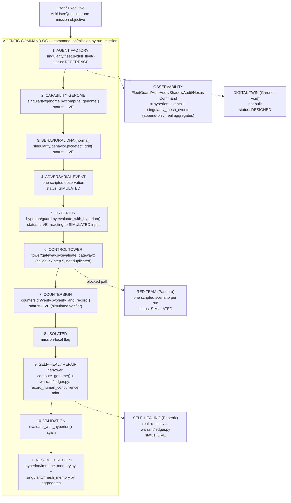

# Agentic Command OS — master architecture

This is the architecture of the layer `command_os/` adds on top of UNWIND's
six existing control layers. It does not replace `ARCHITECTURE.md` (the
UNWIND-core / consequence-clearing architecture, one level down) — it sits
above it and names the same components, not new ones.

**Read this in under 90 seconds:** one function
(`command_os/mission.py:run_mission`) calls, in order, six modules that
already existed and were already live before this layer was added. Nothing
in this document is a component that doesn't have a file.

## The chain

## Component table

| Layer in the chain | Real module | Function | Status |
| --- | --- | --- | --- |
| Agent Factory | `singularity/fleet.py` | `full_fleet()` | REFERENCE — static 7-role topology, no live spawning |
| Capability Genome | `singularity/genome.py` | `compute_genome()` | LIVE — pure function, zero model calls |
| Behavioral DNA | `singularity/behavior.py` | `detect_drift()` | LIVE — pure function, zero model calls |
| Hyperion-Zero | `hyperion/guard.py` | `evaluate_with_hyperion()` | LIVE — read-only wrapper, never overturns the Gateway |
| Control Tower | `tower/gateway.py` | `evaluate_gateway()` | LIVE — the one choke point; principal → scope → budget → warrant, in that fixed order |
| Warrant | `warrant/ledger.py` | `spend_or_refuse`, `mint`, `record_human_concurrence` | LIVE — append-only ledger, atomic transaction |
| Countersign | `countersign/verify.py` | `verify_and_record()` | LIVE — simulated verifier in this mission (`UNWIND_COUNTERSIGN_SIMULATED=1`); the real Gemma path exists in `countersign/agent.py` and is exercised elsewhere (`docs/LIVE-VERIFICATION.md`) |
| UNWIND core | `spine/cascade.py` | `run_cascade()` | LIVE, but **not invoked by this mission** — see "What this mission does not do," below |
| Observability | `hyperion/immune_memory.py`, `singularity/mesh_memory.py` | `aggregate_fleet_summary()`, `aggregate_mesh_summary()` | LIVE — real folds over append-only logs, empty log returns honest zeros |
| Red Team | one scripted `BehaviorObservation` in `command_os/mission.py` stage 4 | — | SIMULATED — one scripted scenario per mission, no autonomous red agent |
| Self-Healing | `command_os/mission.py` stages 9–10 | narrower `compute_genome()` + real `mint()` | LIVE |
| Digital Twin | — | — | DESIGNED — not built, no simulation/forecasting engine exists |

## What this mission does not do

The stage list above deliberately does not force a call into `spine/cascade.py`
(UNWIND core's claim-retraction consequence engine). UNWIND core's job is
computing what must be un-sent, un-paid, or apologised for when a **claim**
turns out false — it has no natural role in an "agent drifts, gets blocked,
gets repaired" security narrative, and no claim is retracted anywhere in this
mission. Forcing an unrelated call into that path to check a box would be
exactly the kind of decorative, disconnected wiring this repository's honesty
discipline exists to refuse. UNWIND core remains fully live and independently
reachable as its own card (`#instrument` → UNWIND CORE, or `enterCore()` in
`web/static/app.js`) — it is simply not part of this particular chain.

## Google Cloud services actually used

Carried over from `ARCHITECTURE.md`'s own table — this layer introduces no
new Google Cloud dependency, it only sequences calls into code that already
used these services:

| Service | Used by |
| --- | --- |
| Firestore | `warrant/ledger.py`, `tower/registry.py`, `hyperion/immune_memory.py`, `singularity/mesh_memory.py` |
| Pub/Sub | `lib/pubsub.py` (UNWIND core's cascade fan-out; not touched by `command_os/`) |
| Cloud Run | hosts the whole FastAPI app, including `/api/command-os/*` |
| Vertex AI | `lib/vertex.py`, reachable from `countersign/agent.py`'s real Gemma path — not called during a `command_os` mission run, which always sets `UNWIND_COUNTERSIGN_SIMULATED=1` |

Deliberately **NOT USED** (same list `ARCHITECTURE.md` already states,
unchanged by this layer): GKE, Cloud SQL/Spanner, BigQuery, Dataflow,
Redis/Memorystore, Model Armor, Dataplex.

## The 15-name concept map

FleetGuard, AutoAudit, Self-Repairing Fleet, Cross-Department Orchestrator,
Overlord AI, Phoenix, ShadowAudit, OmniFleet, Chronos-9, Aegis-Neuro,
Chronos-Void, Pandora, Vigilante AI, Nexus Command, and Nebula OS do not
appear anywhere in this repository's code, docs, or evidence — a
repository-wide search finds zero hits. Each name is mapped to the real
module that provides its functional purpose, with an honest status, in
`docs/COMMAND-OS-CONCEPT-MAP.md` (single source of truth:
`command_os/concept_map.py`). This document does not repeat that table.
